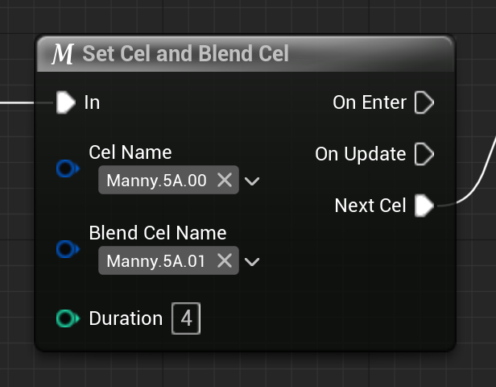
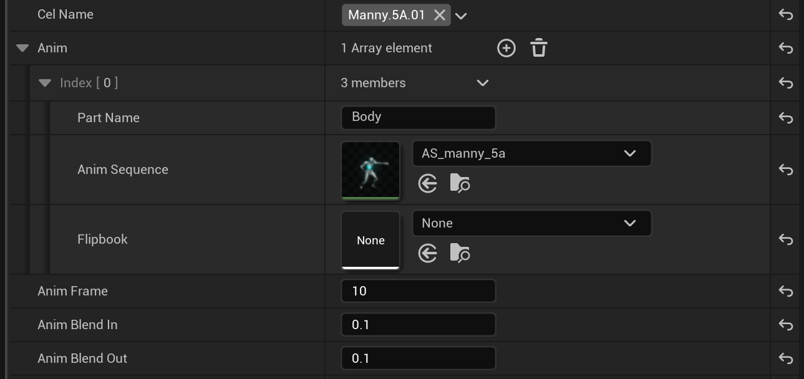
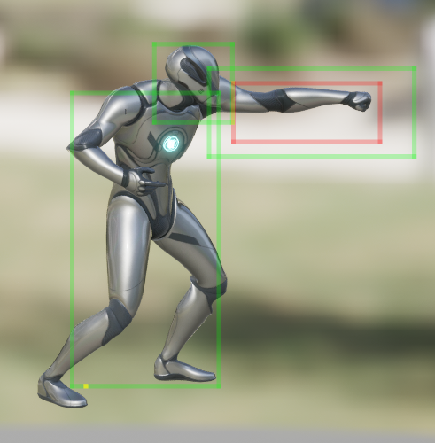
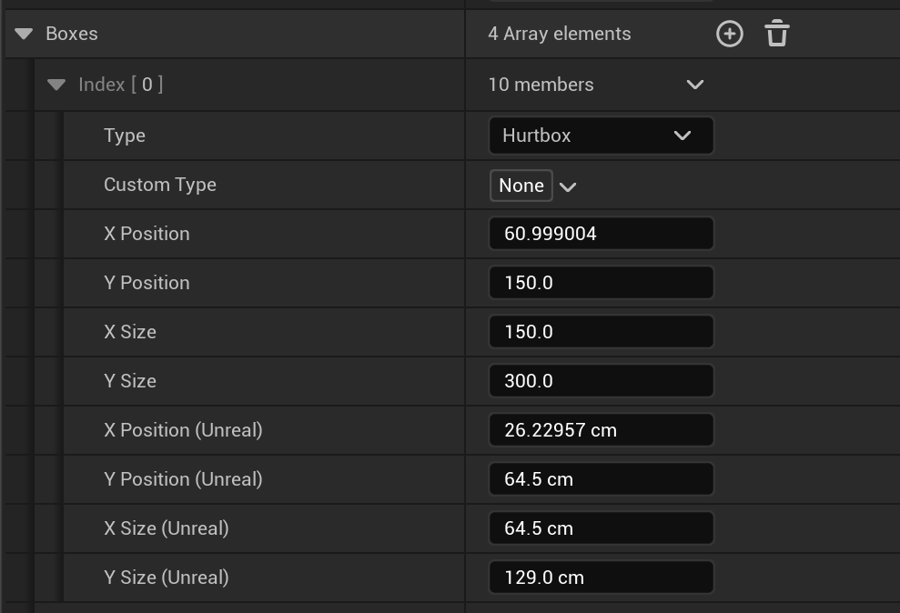

Collision Data and Cels: Tying Frame Data, Animations, and Hitboxes Together
===================

In Night Sky Engine, the concept of a Cel is what ties a character's frame data, animations, and hitboxes together. As such, it's the most vital data for a character. I briefly touched upon it in [Getting Your Bearings](../getting-started/bearings.md) from the Quick Start Guide, but here, I'll explain in more detail how Cels work and how to make new Cels.

## Frame Data
A Cel can be thought of as a sort of "keyframe". They're named as such to invoke the idea of an animation cel. When combined with a State Blueprint, the Cel determines how long the character's current hitboxes and pose lasts for.

The reason such a system is used, and not something like a frame data timeline (such as using Unreal Engine's Anim Notifies), is that it makes adjusting the animation to match the frame data incredibly easy. For example, if you have a punch animatoin, and put a Cel at frame 0 (punch start) and another cel at frame 10 (punch fully extended), but then decide that the punch should actually have 4 frames of startup instead, you don't have to edit the animation, reimport it, modify the Cels, and the State. Instead, you can just set the *duration* of the `Set Cel and Blend Cel` node in your State blueprint to 4.

## Animation
This section assumes that you have an Anim Sequence in Unreal Engine for your character. If not, [here's a link to official documentation for animation importing.](https://dev.epicgames.com/documentation/en-us/unreal-engine/importing-animations-using-fbx-in-unreal-engine)

In the Collision Data asset of your character, each Cel has associated animation data.

This screenshot has quite a bit going on, so let's break it down:

- Anim: An array of animations for your Player Object. It's structured in an Array format to allow different animations on different Components.
    - Part Name: This is the name of the component that will be assigned the animation. For example, if you have a Skeletal Mesh Component named "Body", it will use the given animation.
    - Anim Sequence: For Skeletal Mesh Components, this is the animation that will be used for the given part.
    - Flipbook: For Paper Flipbook Components, this is the flipbook that will be used for the given part.
- Anim Frame: The frame of animation that will be used for this Cel. This depends on your animation's frame rate.
- Anim Blend In: For Skeletal Mesh Components, this controls the "blend in" time. This is used for when the animation asset is different from the currently playing asset.
- Anim Blend Out: For Skeletal Mesh Components, this controls the "blend out" time. This is used for when the animation asset of the next Cel is different from this Cel's.

## Hitboxes
Finally, every Cel can have an arbitrary number of boxes. The Collision Data editor comes with a built-in preview for the boxes, relative to the animating character.

Every Collision Box comes with some properties. Here's what they all do:
- Type: There are five types of boxes.
    - Pushbox. This is currently unused, as push collision is handled elsewhere. However, this is planned to be an option as a separate push collision system.
    - Hurtbox.
    - Hitbox.
    - Offset. This can be used as a "root motion" system for sprites.
    - Custom. This box type can be used in conjunction with the `Custom Type` property for custom logic.
- Custom Type: For boxes with the Custom type, this specifies what kind of custom box it is. You can set any tag you want, but it should preferably use the naming convention `Collision.<Type>`.
- X Position: The box X axis position relative to the character's origin in Night Sky units, divided by 1000. The position is used as the box center.Updating this will update the `X Position (Unreal)` property, and vice versa.
- Y Position: The box Y axis position relative to the character's origin in Night Sky units, divided by 1000. The position is used as the box center. Updating this will update the `Y Position (Unreal)` property, and vice versa.
- X Size: The box width in Night Sky units, divided by 1000. Updating this will update the `X Size (Unreal)` property, and vice versa.
- Y Size: The box height in Night Sky units, divided by 1000. Updating this will update the `Y Size (Unreal)` property, and vice versa.
- X Position (Unreal): The box X axis position relative to the character's origin in centimeters. The position is used as the box center. Updating this will update the regular `X Position` property, and vice versa.
- Y Position (Unreal): The box Y axis position relative to the character's origin in centimeters. The position is used as the box center. Updating this will update the regular `Y Position` property, and vice versa.
- X Size: The box width in centimeters. Updating this will update the regular `X Size` property, and vice versa.
- Y Size: The box height in centimeters. Updating this will update the regular `Y Size` property, and vice versa.

| Previous          |
|:------------------|
| [Project Structure](structure.md) |