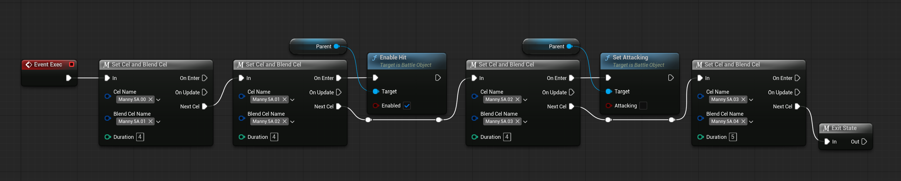

Your First State
===================

Let's put what you've learned into practice, and create a new state.

First, navigate to your character's folder in the Content Drawer. An example path would be `Blueprints/Characters/Manny/States`. Right-click in an empty spot of the Content Drawer, and create a new Blueprint. 

Generally, you do not want to inherit directly from the State class. Instead, I have prepared a plethora of state templates in `Blueprints/Characters/Common/States`. In this example, we'll create a normal attack, so let's inherit from `ST_CommonNormalAttack`.

The standard naming convention for states is `ST_{Character}{StateName}`. We'll be creating a new standing light, so let's go with `ST_MannyNmlAtk5A`. If you don't understand the state name, [there is a page on Infil's Fighting Game Glossary about numpad notation.](https://glossary.infil.net/?t=Numpad%20Notation#:~:text=A%20way%20to%20describe%20joystick,d%20call%20it%20%222MK%22.)

First, you should define default values for your State. On the rightmost panel, you will see the Details tab. For now, here's the basics you need to understand about the State defaults:

- The name of your State is used to directly reference the State (for example, in Cancels or Jump to States).
- The Entry Stance determines what character stance (standing, crouching, jumping) the state may be entered from. If it is set to None, any state will work.
- Input Condition Lists handles input conditions. If one Condition List's requirements is met, the state may be entered. 

Start by setting the State name to a fitting Gameplay Tag (such as `State.Attack.Normal.5A`), and the entry stance to Standing. For the Input Condition Lists, add one entry, then open the dropdowns. You will notice a new array, called Input Conditions. These are the actual conditions that the list contains. All of these conditions must be met in order for the list to be considered successful.

For now, add a new entry into the Condition's Sequence, and set the Input Flag to A (for light). Then, set the Method of the condition to Once. This means that it will only register the input on first press.

Now that the default values have been set up, you should move on to the actual code. However, you'll notice that your new State currently has no code. Let's add some!

On the leftmost panel, there should be a section labeled Functions. If you hover over it, you'll see a dropdown called "Override". First, override the Init function. It will create an Init function, which calls the parent function from `ST_CommonNormalAttack`.

Under Init, you will handle all state values that need to be set when netering the state. In this case, we'll be setting the attack data, such as strength and damage. 

To interact with the State's owning object, you will need to Get the Parent. Right-click on an empty spot in the Function Graph, and type "Get Parent". Find the bottommost entry and click it. This will create a node in the Function Graph which gives you access to the owning object.

In this case, we want to call a Subroutine that initializes the default attack values. Drag on the blue circle at the rightmost edge of the Parent node, release the mouse, and type "Call Subroutine". Click on the entry, and a new node will appear. This node will call a Subroutine that is stored within the Common Subroutine Data. Under Name, find the gameplay tag for `Subroutine.Cmn.AttackLevel.1`, which will set default attack values. Then, connect the leftmost white arrow to the "Parent: Init" node's rightmost white arrow.

Now, we'll go back to the "Override" menu, and override the Exec function. This will create a new Event in the Event Graph. You may notice the lack of a "Parent: Exec" node in this override. Unless you are sure that you do not want the parent State's default functionality, it is best to create this node yourself. Right-click on the "Event Exec" node, and click "Add Call to Parent Function". Then, wire in the "Parent: Exec" node to "Event Exec".

There are a lot of nodes that should be plugged into Exec, so I won't explain everything step-by-step. Instead, replicate the following image's node setup: 

I will explain what each macro or function call does, however:

- Set Cel and Blend Cel sets the Cel and Blend Cel names. The Cel system was previously explained, but Blend Cels are used to have limited interpolation between the data of two Cels. In this case, we're using it to interpolate the animation's frame. The Blend Cel is automatically set based on the ending digits of the Cel Name.
- Enable Hit must be called when you wish to hit the opponent, and Enabled must be set to True to allow hitting the opponent.
- Set Attacking changes the attacking state of the object. When attacking, the object is allowed to hit or Chain Cancel, but may be counter hit in return. Meanwhile, when not attacking, the object may not hit the opponent or Chain Cancel, but is no longer vulnerable to counter hits.
- Exit State will exit the current state and enter the default state for the current stance (standing, crouching, or jumping).

Congrats, you have created your first State! Now, to see it in action, open the character's State Data. In this case, it is located at `Blueprints/Characters/Manny/DA_MannyStates`. Open the asset, and add a new entry to the State Array. Set the value to `ST_MannyNmlAtk5A`. Now, you can open Play in Editor and test out your new state.

| Previous          |
|:------------------|
| [What Is A State? Part 2](state-p1.md) | 